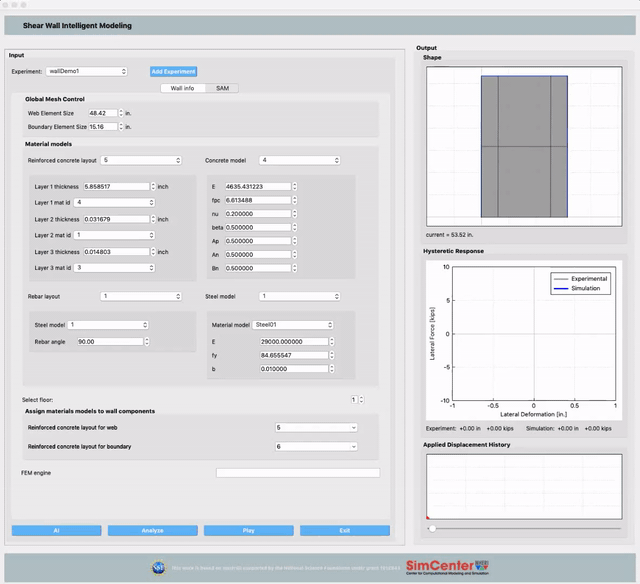

# SWIM: AI-enabled finite element modeling of concrete shear walls

### What is SWIM?

Shear walls are commonly used lateral resisting systems in buildings. During large events, particularly seismic events,
the buildings may experience shear failure of these walls. Capturing the behavior of individual walls to
shear failure is critically important if one is to determine the response of such buildings to large magnitude events.
This application is intended to educate users on how concrete shear walls should be modeled when performing
numerical simulations of the entire building. This application will allow the user to explore how different modeling
assumptions affect the response of a concrete shear wall element and how the simulated response compares with actual experimental
data. Machine learning algorithms are inserted into the backend to help users choose reasonable parameters for the model.
Allowing the user to validate their modeling assumptions is critically important for the user to gain competence
in this area, as just producing hysteresis loops that look meaningful can be dangerously misleading.

### Download the app and the document

[Download here.](https://www.designsafe-ci.org/data/browser/public/designsafe.storage.community/SimCenter/Software/SWIM)

### How to Cite
You can cite this software as follows:

Charles Wang. (2019, October 7). NHERI-SimCenter/SWIM: Release v1.0.1 (Version v1.0.1). Zenodo. http://doi.org/10.5281/zenodo.3475481

### Acknowledgement
This material is based upon work supported by the National Science Foundation under Grant No. 1612843.

### Contact
Charles Wang, NHERI SimCenter, UC Berkeley, c_w@berkeley.edu
